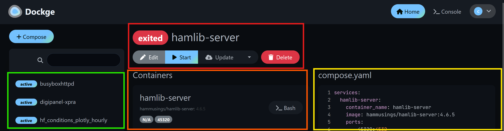
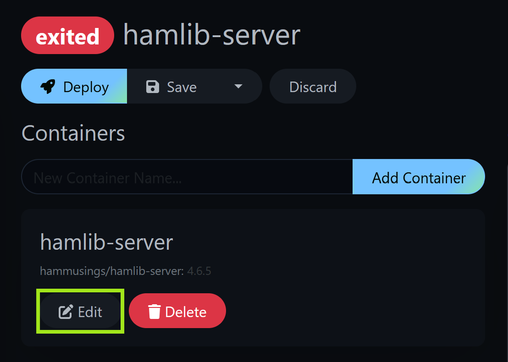
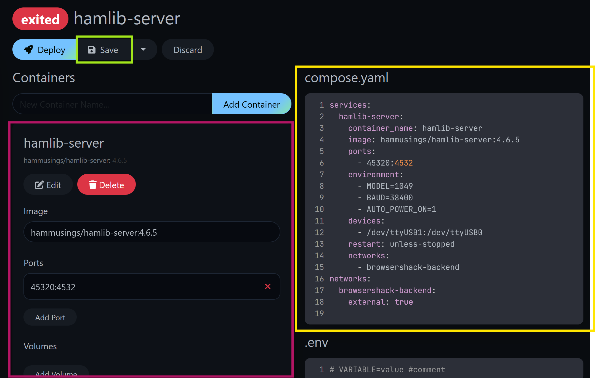
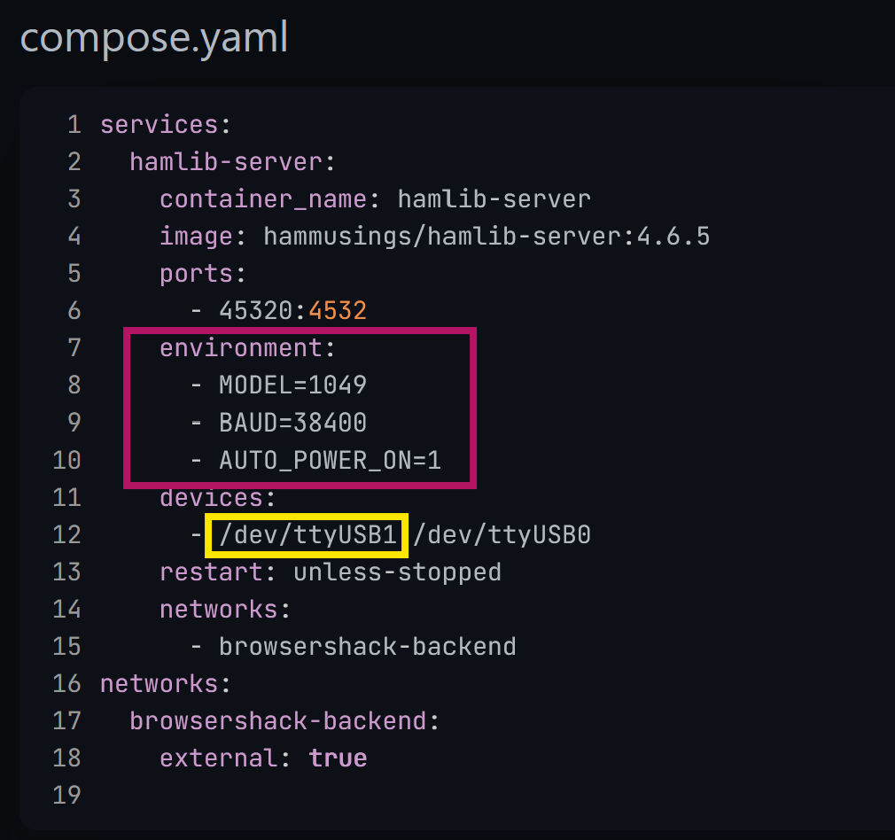
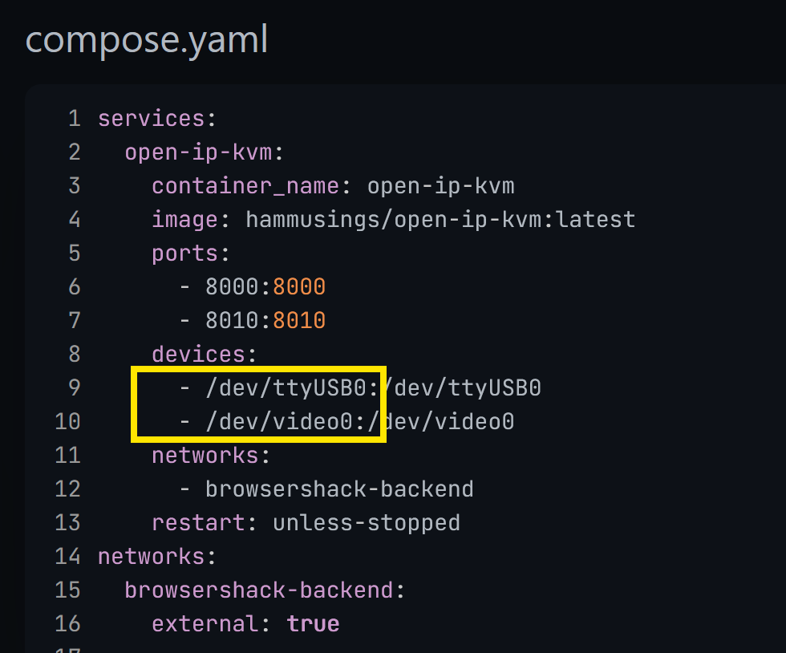
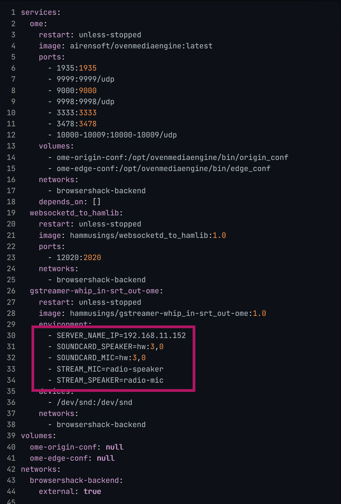

# Post Installation Configuration

## Edit and Start Docker Containers

### Quick Dockge Orientation



There are 4 main sections to Dockge interface:
1) Stack list & status (Green Box)
2) Current stack action menu (Red Box)
3) Current containers in the stack (Orange Box)
4) Docker compose.yaml file for the currently selected container (Yellow Box)

In the action menu you can select, start, stop, restart, and edit (more options available).  For now selecting edit the stack takes you to this window where you can select to edit each container with the button in the Green Box.



Then you can edit the container either directly in the compose.yaml file window (Yellow Box) or if the container offers it via the form (Maroon Box).



Once edited hit save to save the compose.yaml file and then start to start the stack.

More information on Dockge and it's detailed use can be found on the [Dockge github page.](https://github.com/louislam/dockge)  This orientation is not meant to be a full tutorial but give enough of a start to be able to follow this configuration and use for BrowserShack.

### Edit Necessary Containers

There are 3 containers that need to be edited before started.  In most cases it is to edit the specific hardware to use.

1) hamlib-server
2) open-ip-kvm
3) phone_voice_stack
4) wavelog

> [!NOTE]
> Make sure to keep the exact format of the compose.yaml file if you edit it directly. For example, do not add spaces around the equal sign in MODEL=VALUE.  Docker compose files will not work if the format is changed.

<ins>**hamlib-server**</ins>

In the Maroon Box edit the settings to match your radio. 

* MODEL: hamlib model radio number
* BAUD: baud rate to communicate with your radio
* AUTO_POWER_ON: hamlib option to automatically power your raadio on when hamlib connects (not available on all radios see hamlib for details)
  * 0: no
  * 1: yes
  
In the Yellow Box edit the serial device path for your radio.  

> [!TIP]  One option to determine the radio's serial port is to run '''dmesg | grep tty'' in the command line of dietpi



Once done hit Save in the action menu.

<ins>**open-ip-kvm**</ins>

In the Yellow Box edit the path to the serial port the CH9329 module is connected to. As well as the path to the video capture card that is attached.

> [!TIP]
> One way to find the video card path is to use ```v4l2-ctl --list-devices``` to use you may need to install v4l2-ctl ``` apt install v4l-utils```



Once done hit Save in the action menu.

<ins>**phone_voice_stack**</ins>

In the Maroon Box edit the settings to match your radio. 

* SERVER_NAME_IP: hostname or ip of your BrowserShack server
* SOUNdCARD_SPEAKER: hardware id of the speaker port on the radio audio connection (Speaker is from the point of view of the sound card -- so audio OUT but that is microphone IN to the radio)
* SOUNDCARD_MIC: hardware id of the microphone port on the radio audio connection (Microphone is from the point of view of the sound card -- so audio IN but that is speaker OUT to the radio)



> [!TIP]  See the [section below on linux and soundcards](#linux-and-sound-cards) for information on how to  find your sound card id and more

Once done hit Save in the action menu.

### Start Containers


> [!TIP]
> Not all containers need to be started and/or used.  Users can choose which containers to use and even add new ones to their stack.  However, any deviation from the full use is not supported and considered an advanced use case.

## Digipanel Setup Information


# Linux and Sound Cards
Often the most tricky part of linux.  
> [!WARNING]
> Depending on your radio the sound cards may disconnect when the radio is powered off. This can lead to sound card IDs moving around and causing issues.

To resolve this you can force and order by editing /etc/modprobe.d/alsa.conf and rebooting.

> [!NOTE]
> If you are using a sound card that is either onboard or using audio connectors to the radio this is likely an unnecessary step but still can be used.

This WILL different for each computer AND radio combination.  The example below is for GMKtec Mini PC N97 + Yaesu FT-710

Add the following to /etc/modprobe.d/alsa.conf
```
options snd slots=snd_hda_intel,snd-usb-audio
options snd-usb-audio index=1,2,3 vid=0x0573,0x2997,0x0d8c pid=0x1573,0x0001,0x0013
```

This tells linux to load any sound cards with the driver snd_hda_intel first and then secondly load the cards using the driver snd-usb-audio second.

However, in the case of this setup there are actually 3 USB sound cards:
1) Onboard sound
2) Video capture card sound
3) FT-710 USB sound card

On each boot and or power cycle of the radio the order of these cards can change.  They will always be card 1, 2, & 3 but which one is which did not stay consistent in my testing.

So to second line forces a sub order the cards by their PID and VID.  So in the above example:

1) Onboard sound = card 1
2) Video capture card sound = card 2
3) FT-710 USB sound card = card 3

Which allows me to set the card for the gsteamer container with hw:3,0 and it will consistently work.

> [!TIP]
> To make this work use lsusb, lsusb -t, aplay -l, and aplay -L to determine your card's VID and PID

> [!TIP]
> This is an optional step but a highly recommended one if your sound card is in the radio itself.


