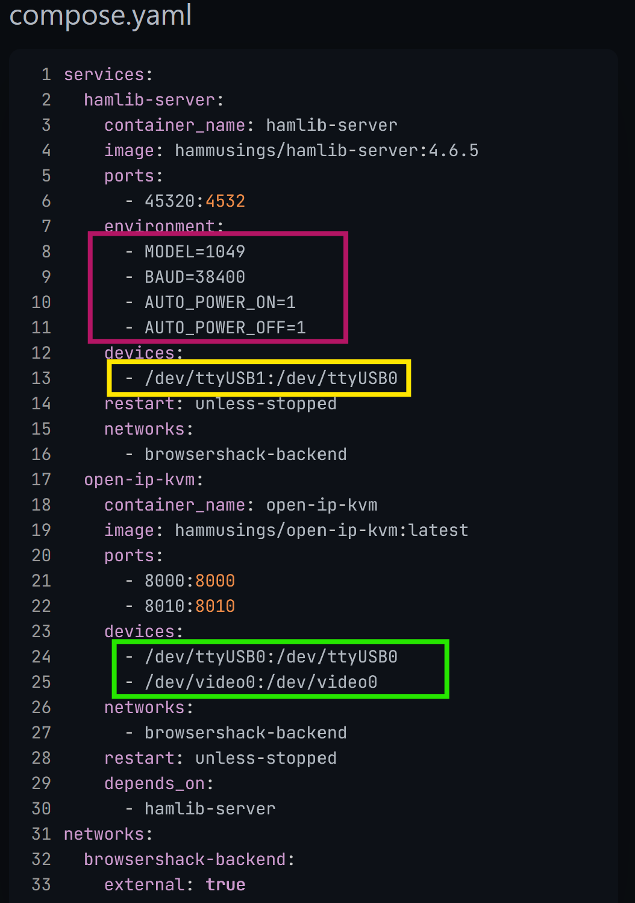
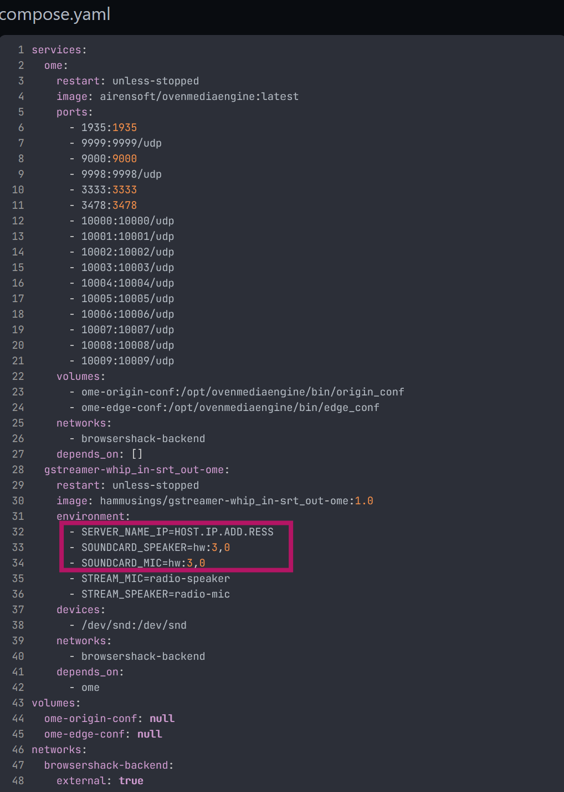
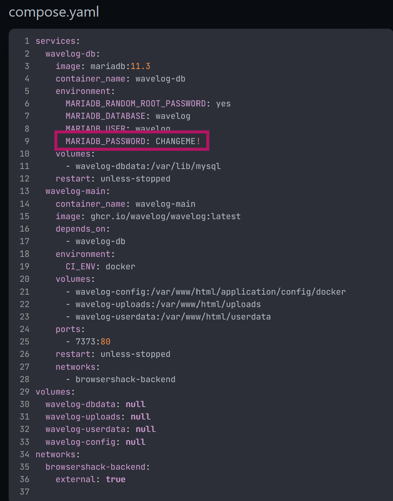
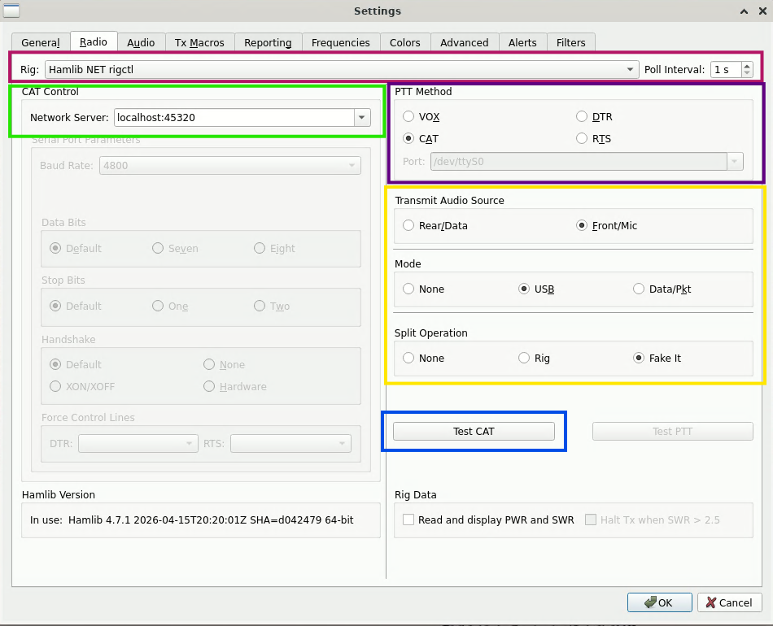
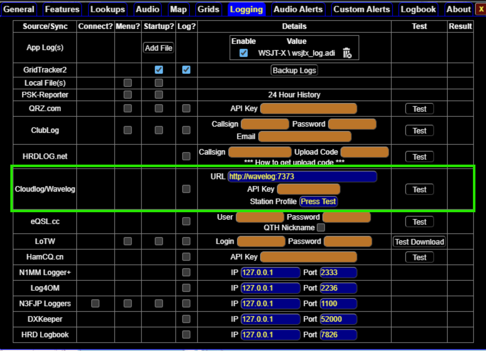

# Post Installation Configuration Menu

- [Edit and Start Docker Stacks](#edit-and-start-docker-stacks)
  - [Quick Dockge Orientation](#quick-dockge-orientation)
  - [Edit Necessary Stacks](#edit-necessary-stacks)
    - [control_stack Settings](#control_stack)
	- [voice_stack Settings](#voice_stack)
	- [wavelog Settings](#wavelog)
  - [Start Stacks/Containers](#start-stacks)
    - [Digital Radio Stack Statuses](#digital-radio-stack-statuses)
	- [Voice Radio Stack Statuses](#voice-radio-stack-statuses)
- [Wavelog Setup information](#wavelog-setup-information)
- [Digipanel Setup information](#digipanel-setup-information)
  - [WSJT-X](#wsjt-x)
    - [Radio Tab](#radio-tab)
	- [Audio Tab](#audio-tab)
  - [GridTracker2](#gridtracker2)
- [Apache Guacamole Configuration Edits](#apache_guacamole_configuration_edits)
  - [Username & Password Changes](#change_username_or_password)
  - [Connection IP Changes](#change_connection_ip)
- [Application Upgrades](#upgrading_applications)
- [Linux and Sound Cards](#linux-and-sound-cards)

# Edit and Start Docker Stacks

## Quick Dockge Orientation


There are 4 main sections to Dockge interface:
1) Stack list & status (Green Box)
2) Current stack action menu (Red Box)
3) Current containers in the stack (Orange Box)
4) Docker compose.yaml file for the currently selected stack (Yellow Box)

In the action menu you can select, start, stop, restart, and edit (more options available).  For now selecting edit the stack takes you to this window where you can select to edit each container with the button in the Green Box.


Then you can edit the container either directly in the compose.yaml file window (Yellow Box) or if the container offers it via the form (Maroon Box).


Once edited hit save to save the compose.yaml file and then start to start the stack.

More information on Dockge and it's detailed use can be found on the [Dockge github page.](https://github.com/louislam/dockge)  This orientation is not meant to be a full tutorial but give enough of a start to be able to follow this configuration and use for BrowserShack.

## Edit Necessary Stacks

There are 3 stacks that need to be edited before started.  In most cases it is to edit the specific hardware to use.

- control_stack
- voice_stack
- wavelog

> [!NOTE]
> Make sure to keep the exact format of the compose.yaml file if you edit it directly. For example, do not add spaces around the equal sign in MODEL=VALUE.  Docker compose files will not work if the format is changed.

> [!IMPORTANT]
> For device lines replace the left side of the : with your host device.  Leave the right side device of the : as is.  (The left is the host device and the right is the device it is mapped to in the container). Example, /dev/REPLACETHISONE:/dev/LEAVETHISONE

### control_stack

In the Maroon Box edit the settings to match your radio. 

* MODEL: hamlib model radio number
* BAUD: baud rate to communicate with your radio
* AUTO_POWER_ON: hamlib option to automatically power your radio on when hamlib connects (not available on all radios see hamlib for details)
  * 0: no
  * 1: yes
* AUTO_POWER_OFF: hamlib option to automatically power your radio off when hamlib disconnects (not available on all radios see hamlib for details)
  * 0: no
  * 1: yes
  
In the Yellow Box edit the serial device path for your radio.  

> [!TIP]  
> One option to determine the radio & CH9329 serial port is to run ```dmesg | grep tty``` in the command line of dietpi

In the Green Box edit the path to the serial port the CH9329 module is connected to. As well as the path to the video capture card that is attached.

> [!TIP]
> One way to find the video card path is to use ```v4l2-ctl --list-devices``` to use you may need to install v4l2-ctl ```apt install v4l-utils```



Once done hit Save in the action menu.

### voice_stack

In the Maroon Box edit the settings to match your radio. 

* SERVER_NAME_IP: hostname or ip of your BrowserShack server
* SOUNDCARD_SPEAKER: hardware id of the speaker port on the radio audio connection (Speaker is from the point of view of the sound card -- so audio OUT but that is microphone IN to the radio)
* SOUNDCARD_MIC: hardware id of the microphone port on the radio audio connection (Microphone is from the point of view of the sound card -- so audio IN but that is speaker OUT to the radio)



> [!TIP]  
See the [section below on linux and soundcards](#linux-and-sound-cards) for information on how to  find your sound card id and more

Once done hit Save in the action menu.

### wavelog

Optional) 

In the Maroon Box edit/create a custom secure password for mariadb.  This will be used when you configure wavelog via the web page later.

> [!TIP]
> By default the install script creates a psuedo random password on each installation.  To use simply open the wavelog stack and locate the text in the Maroon box and use that for setup.



Once done hit Save in the action menu.

## Start Stacks

Start the stacks marked Active below and stop the stacks that are marked Inactive below.

### Digital Radio Stack Statuses

- Active
  - browsershack_web_frontend
  - control_stack  
  - wavelog
  - guacamole
- Inactive
  - voice_stack
- Desktop Applications Open
  - WJST-X or JS8Call
  - GridTracker2 optinal

### Voice Radio Stack Statuses

- Active
  - browsershack_web_frontend
  - control_stack  
  - wavelog
  - voice_stack
  - guacamole
- Inactive
  - none
- Dekstop Applications CLOSED
  - WSJT-X
  - JS8Call

  
If the stacks don't start successfully check the settings edited above. Particularly, serial port mappings.

Once they all have started access the main page at:

http://hostname

Access the other setup panels via the main page.

# Wavelog Setup Information

When you launch Wavelog for the first time it will walk you through setting it up and creating a user.  The only specific settings for BrowserShack are:

* Database Server: wavelog-db
* Database Name: wavelog
* Database Password: Either the generated password at install or the password that was changed in the compose.yaml

All other setup and use are covered on [Wavelog's github wiki](https://github.com/wavelog/wavelog/wiki/Dashboard)

# Digipanel Setup Information

Most of the setup for WSJT-x and GridTracker2 are not special to BrowserShack.  Refer to their specific websites for more information on general configuration / use.  

* [WSJT-X](https://wsjt.sourceforge.io/wsjtx.html)
* [GridTracker2](https://gridtracker.org/)

Most of the specific settings are using the correct names to connect the services

## WSJT-X

### Radio Tab
For the radio setting on WSTJ-X set:
* Rig: Hamliib NET rigctl (Maroon Box)
* Network Server: hamlib-server:4532 (Green Box)
  * This is static container name within BrowserShack so the network traffic doesn't leave the Server
  * Port is the internal port number of the hamlib-server container NOT the external port of 45320
* PTT Method: CAT (Purple Box)
* Transmit Audio Source, Mode, and Split Operation: Dependent Upon your radio (Yellow Box)

Then hit Test CAT to see if the settings are working (Blue Box)



### Audio Tab

Your audio sources have been mapped from the host computer.  So the exact settings will depend on your radio, sound card, and setup.  See [below](#linux-and-sound-cards) for some tips on IDing your card and devices.  This may take some testing each option before finding the one(s) that works.

## GridTracker2

GridTracker2 will automatically find WSJT-X running on the same machine so the only setup is if you want to log directly to Wavelog. 



# Apache Guacamole Configuration Edits
  ## Change Username Or Password
  ## Change Connection IP

# Linux and Sound Cards
Often the most tricky part of linux.  
> [!WARNING]
> Depending on your radio the sound cards may disconnect when the radio is powered off. This can lead to sound card IDs moving around and causing issues.

To resolve this you can force and order by editing /etc/modprobe.d/alsa.conf and rebooting.

> [!NOTE]
> If you are using a sound card that is either onboard or using audio connectors to the radio this is likely an unnecessary step but still can be used.

This WILL different for each computer AND radio combination.  The example below is for GMKtec Mini PC N97 + Yaesu FT-710

Add the following to /etc/modprobe.d/alsa.conf
```
options snd slots=snd_hda_intel,snd-usb-audio
options snd-usb-audio index=1,2,3 vid=0x0573,0x2997,0x0d8c pid=0x1573,0x0001,0x0013
```

This tells linux to load any sound cards with the driver snd_hda_intel first and then secondly load the cards using the driver snd-usb-audio second.

However, in the case of this setup there are actually 3 USB sound cards:
1) Onboard sound
2) Video capture card sound
3) FT-710 USB sound card

On each boot and or power cycle of the radio the order of these cards can change.  They will always be card 1, 2, & 3 but which one is which did not stay consistent in my testing.

So to second line forces a sub order the cards by their PID and VID.  So in the above example:

1) Onboard sound = card 1
2) Video capture card sound = card 2
3) FT-710 USB sound card = card 3

Which allows me to set the card for the gsteamer container with hw:3,0 and it will consistently work.

> [!TIP]
> To make this work use ```lsusb```, ```lsusb -t```, ```aplay -l```, and ```aplay -L``` to determine your card's VID and PID

> [!TIP]
> This is an optional step but a highly recommended one if your sound card is in the radio itself.


