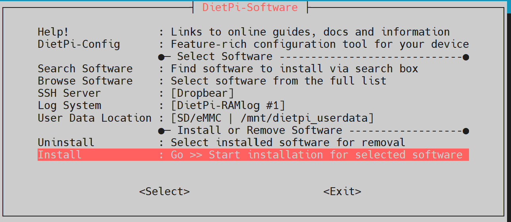
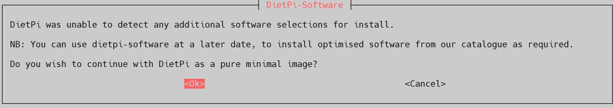

# BrowserShack Installation

## Pre-Requisite
- Radio with video out and mouse in for full features
  - USB Video Capture card
  - CH9239 UART/TTL serial port to USB HID (Human Interface Device) converter
- X86_64 machine with DietPi installed

### Install DietPi Linux Distro

- [DietPi](https://dietpi.com) 
  - https://dietpi.com/docs/install/#how-to-install-dietpi-native-pc
  - DietPi .iso Downloads: https://dietpi.com/#download
  - When prompted to install applications skip it
    - 
  - DietPi will ask if you want to install an pure minimal system.  Answer ok.
    - 

## Base BroswerShack Install

This install script walks you through a few dietpi setup screens, installs required base apps via DietPi software menu, installs Dockge docker compose manager, and copies neccessary files for BrowserShack to their correct locations so DietPi backup can be used and the docker containers are premapped to the locations.

- Webpage files
  - hostname is dynamically replaced in web page link files
- docker-compose.yaml files for each container to Dockge locations
- OvenMediaEngine Server.xml configuration file

Run the following command to download the setup script, make it executable, and run it.  The script will take care of the rest of the basic setup.  
  - ```wget https://raw.githubusercontent.com/hamMUSings/BrowserShack/refs/heads/dev/install.sh
  sudo chmod +x install.sh
  ./install.sh```

## Open Dockge
  
Once this installation is done Dockge will be available at:

http://hostname:5001

Open it and set a secure password.  

Then move onto [Post Installation Configuration directions](Configuration.md).
