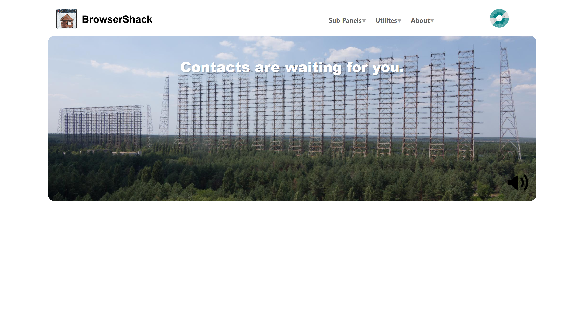
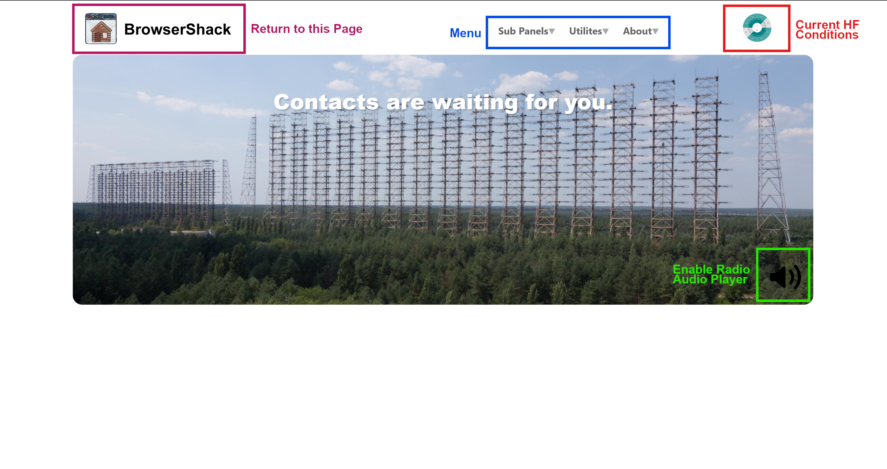
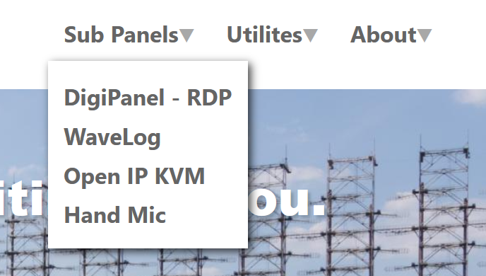
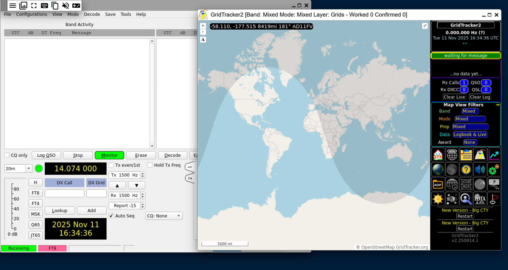
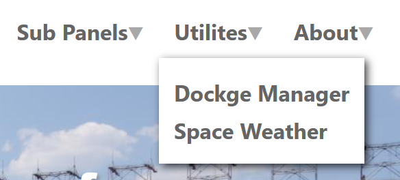
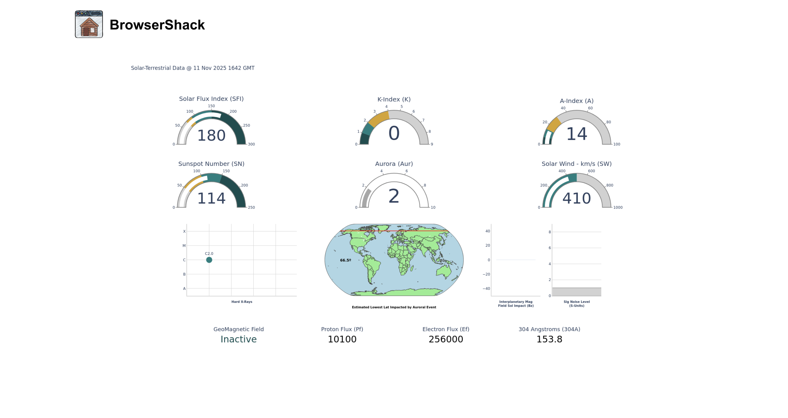
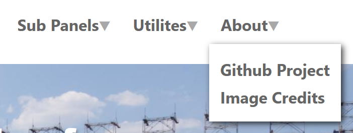
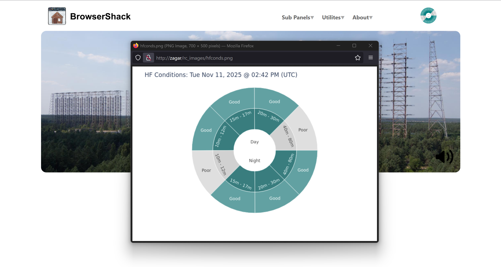
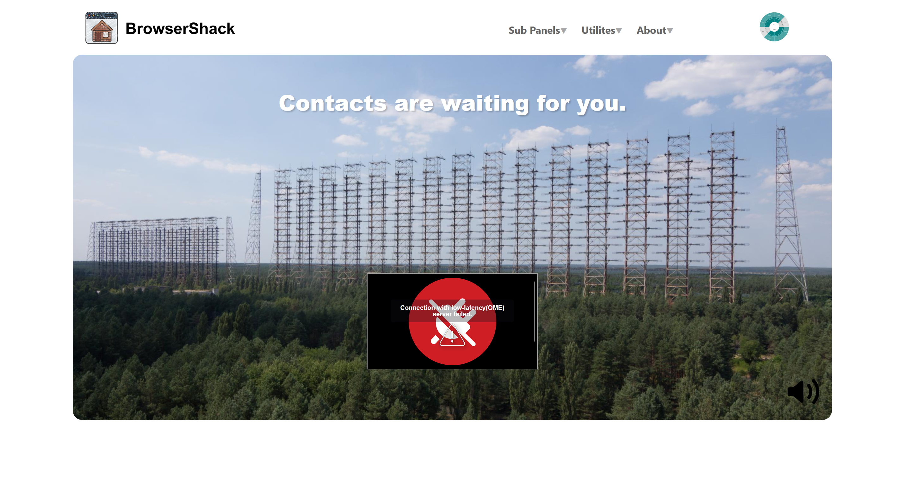
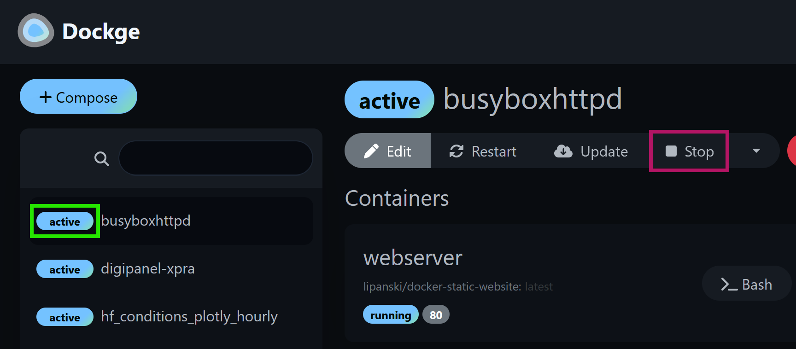

# BrowserShack Summary

This is a a collection of containerized tools to make a browser based FT-8/Digital focused remote setup with a very lightweight web based launcher to tie them all together.

It goes one step further and focuses on radios that have video output and keyboard/mouse input to control the radio via an simple IP KVM.  Such as a Yaesu FT-710. This eliminates complex web interface for controlling the radio and keeps it simple: use the radio like you were in front of it. Natively.

> [!NOTE]
> Designed and best used for digital modes

> [!NOTE]
> Designed and best used for radios with video out and mouse input in -- eg Yaesu FT-710

> [!IMPORTANT]
> BrowserShack is a headless server solution that is meant to be accessed from other devices web browsers. There is NO desktop environment in BrowserShack to reduce hardware requirements.

This package includes:

* Custom Lightweight web-launcher for all the tools -- so you don't have to remember the port numbers for each docker container plus a little extra
* Hamlib server for all other control / logging apps to bind to -- other applications don't even have to be running on this machine
* Dockge Web-Based Docker Manager -- to edit customs settings and monitor each tools docker container
* Open IP KVM - Lightweight and no security updated ip kvm that now uses ustreamer and CH9329 UART module for mouse/keyboard control ([Option]( https://www.aliexpress.us/item/3256807460786666.html?spm=a2g0o.order_list.order_list_main.5.7fb91802YVei7O&gatewayAdapt=glo2usa))
* Wavelog - Fully featured web-based logging application
* Custom DigiPanel running WSJT-X, GridTracker2, and JS8Call via an xpra session accessible via a web page
* Custom WebRTC Handmic application: Mic to the radio with PTT and bare-bones controls: Mode (USB,LSB, FM) and Frequency change
  * Includes custom websocketd server to interface handmic webpage with rigctl/rigctld
  * Audio output from the radio is included on the home page: Two Way Audio!

All this and more! Well all this and if you want to add anything you can.

# Documentation Menu

1) [Overview & Design Notes](#overview-and-design-notes)
2) [Installation](Installation.md)
3) [Post Installation Configuration](Configuration.md)
4) [Manual](#manual)
5) [Daily Use Flow Example](#daily-usage-flow)
5) [Developer / Contributor Notes](DevNotes.md)

# Overview and Design Notes

## Primary Impetus for BrowserShack
One of the biggest reasons for me to consolidate these features is to keep all the audio routing for FT-8, etc local to the server. There is no reason to bring the audio to another computer to process it and then route the outbound audio back.  It only adds additional overhead that isn't needed. A secondary reason is then all the audio routing virtual cables can stay in place and my main computer, tablet, or phone doesn't have to change audio settings each session of FT-8 or ham radio after watching a youtube video or even at the same time.

## Design Goals
* Digital First 
  * Many other remote radio products focus on phone/voice as the primary mode and digital as an add on
* Web-Based Entirely
* X86-64 Native 
  * I love my Raspberry Pi/ARM machines and I ran out of horse power while running GridTracker when I got a better radio
  * More processing power for decode
  * Cost of a low power but more powerful than ARM mini-computers is very close to the cost of a Raspberry Pi 
  * Technically all the docker containers can be rebuilt for ARM with docker build I just haven't
* Docker
  * Build all parts in docker containers
  * This is a more modern approach to virtualization at the moment
  * Allows users to pick and choice which 'application' or role is important to them and easily reduce resources used with a simple start/stop of docker container
* IP-KVM Focused
  * By focusing on radios that made video out and mouse input in the web front end can be greatly simplified
  * Users can use the same UI to their radio on the computer so learning curve is less
  * One Stop learning curve -- Can easily sit down in front of the radio and the controls learned transfer
* Open Source and Free
* Build on Diet-Pi
  * Allows many hardware options to easily be supported
  * Allows easy core applications install with pre-configured optimization
  * Can be 'ported' to ARM easily and the install script will still work
  * Allows use of built in utilities:
    * Alsa config
	* Hostname setting
	* Backups
	* User data migration to a different drive / folder
* KISS Web Front end
  * Easier and simpler to build
  * Easier and simpler to maintain / contribute to the project
    * Some projects have a steep initial learning curve to contribute back or fork the goal here was to keep things as simple and straightforward as possible to allow easy initial access to modifying or contributing 
	* This includes using docker images / compose from projects that offer them already
* Phone / Voice option with WebRTC Audio routing
  * Simpler PTT web page primarily with a few other convenient options
  * Majority of controls via IP-KVM
  * WebRTC allows browser based audio in and out so no separate applications are needed
* LAN focus
  * Low security was acceptable for ease of building. As such not intended to be exposed to the internet directly
  * Remote radio work from anywhere in the house not anywhere in the world
  * Allows radio to be mounted in a less viewed area and still easily used

# Manual

## Main Page 

The main page is intentionally very simple. There are 4 main areas of note:

1) Menu (Blue Box)
2) HF Conditions Modules (Red Box)
3) Enable Radio Audio Player (Green Box)
4) Return to Main Menu logo (Maroon Box)

### Menu

**<ins>Sub Panels</ins>**

This is the main set of links for BrowserShack. Each 'sub panel' opens up in a new tab for ease of multiple windows at one time.

<ins>DigiPanel - XPRA</ins>

This is the main interface for digital radio.  It opens a webpage with WSJT-X and GridTracker2 automatically opened.  JS8Call is also installed but doesn't auto run.

For more information on the use and features of this panel visit the [github repository for the docker container.](https://github.com/hamMUSings/digipanel-xpra)

> [!IMPORTANT]
> For the specific BrowserShack setup see the [Post Installation Configuration](configuration.md) page.

<ins>Wavelog</ins>

Wavelog is an open source logging software.  It is by default included as its own docker stack as provided by the Wavelog project.  For detailed directions see the [Wavelog github repository.](https://github.com/wavelog/wavelog)

> [!WARNING]
> Make sure to change the MariaDB login password in the docker-compose.yaml file before launching the first time.  Directions are in the [Post Installation Configuration](configuration.md) page.

<ins>Open IP KVM</ins>

This opens the KVM to interface with your radio via it's video out and mouse input in. For detailed directions on how to setup and configure the KVM see the [Post Installation Configuration](configuration.md) page.

> [!NOTE]
> For this feature to work well you need a radio with video out and mouse in.  As well as a video capture card and CH9329 controller connected to your server.  

> [!WARNING]
> Some radios treat mouse in oddly.  The one I know of is the Yaseu FT-710. For this to work on the FT-710 you will also need an adapter as described [here](https://hammusings.wordpress.com/2025/01/04/yaesu-ft-710-mice-compatibility-issue-solution/) between the radio and the CH9329 cable. 

<ins>Hand Mic</ins>

This is a custom interface to turn any web enabled device into a handmic for the radio while in phone mode of BrowserShack.

**<ins>Utilities</ins>**

This menu items holds more utilitarian links.

<ins>Dockge Manager</ins>

This is the docker-compose.yaml manager with all the pre-configured docker-compose.yaml files for BrowserShack included. This will be where you go to start and stop services including hamlibd server and toggling the digipanel and phone stack as needed.  It is also where the configuration for your system is done.  For configuration options see [Post Installation Configuration](configuration.md) page.

And for more information on Dockge project in general visit the [Dockge github repository.](https://github.com/louislam/dockge)  

<ins>Space Weather</ins>

This is a more detailed custom visutalization of data from hamqsl.com. All metrics outside of HF Conditions as provided by hamqsl.com are included.  It refreshes every hour by default and is updated via a docker container in BrowserShack.  For more detailed information visit my [github for the docker container.](https://github.com/hamMUSings/hfcondsgraph-plotly)

**<ins>About</ins>**

This has a link that brings you directly to this github repository and a link to open a tab with all the credits for 3rd party applications and images used in BrowserShack.

### HF Conditions Module

This is a custom visualization of data from hamqsl.com.  It refreshes every hour by default and will open a larger image when clicked. For more detailed information visit my [github for the docker container.](https://github.com/hamMUSings/hfcondsgraph-plotly). The docker container to update this information is included on BrowserShack.

### Enabled Radio Audio Player

When clicked the speaker icon will show the player for the audio player from the radio as shown below.  This audio stream is only active when you have enabled the voice feature of BrowserShack. 

To hide the audio player again click the same speaker icon.

## Dockge Usage

Dockge is a core part of the system. It allows easy monitoring of all the containers in BrowserShack.  It is also how you start and stop applicable subsystems notably:

1) Hamlib RIGCTLD Server & IP KVM Server - control_stack stack
2) Toggle Digipanel and Phone subsystems

Turning off the control_stack (hamlib server and ip-kvm) is the primary security method of this setup. 

> [!WARNING]
> It is highly recommended to turn off the 'control_stack' stack when not in active use. This reduces the change of anyone accidentally or maliciously keying the radio without your knowledge.

> [!TIP]
> The bundled hamlib-server container has the option of auto-start/auto-stop flag on hamlib set so if your radio supports being woken by hamlib when this container is started the radio will turn on and turn off when stopped

After logging in Dockge you will see the container stacks listed on the left with 3 main statuses:

1) Active - Stack is running
2) Exited - Stack is stopped
3) Inactive - Stack is stopped and told to not start 

To stop an active stack click on the active stack (green box) and in the bar click on "Stop" (maroon box). To start a stack select the Exited stack and click "Start"

In general all stacks should be Active except control_stack when you don't want the radio on.  And either/or digipanel-xpra OR voice_stack.  There may be other reasons to turn off each container but that is up the individual users to determine.

For more detailed use of Dockge see the [Dockge github repository.](https://github.com/louislam/dockge)

# Daily Usage Flow

Once everything is configured and all containers are confirmed to start and run correctly here are some general tips for using BrowserShack regularly.

## To Start

1) Open BrowserShack web page
2) Launch Dockge page
3) Start the control_stack stack
   - Make sure the radio is already on if yours does not auto-start with hamlib connection
4) Start either the 
   - digipanel-xpra stack
   - voice_stack 
   - depending on how you want to radio today
5) Launch either the 
   - DigiPanel - XPRA web page
   - Hamdmic page 
   - Again depending on how you want to radio today

## While Radio-ing

- Use Wavelog to log your contacts
- Use Open IP KVM to either view your radios settings or to change anything you want

## To Stop

1) Launch Dockge and stop the control_stack stack
   - If auto_power_off is set to 1 and the radio supports the feature it will turn off with the stack

 